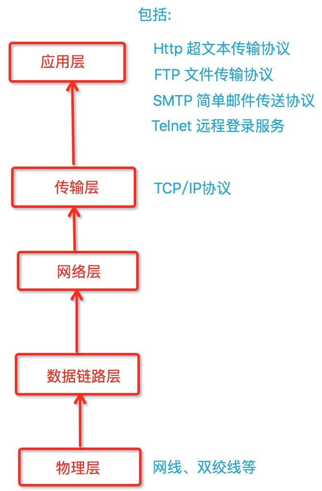
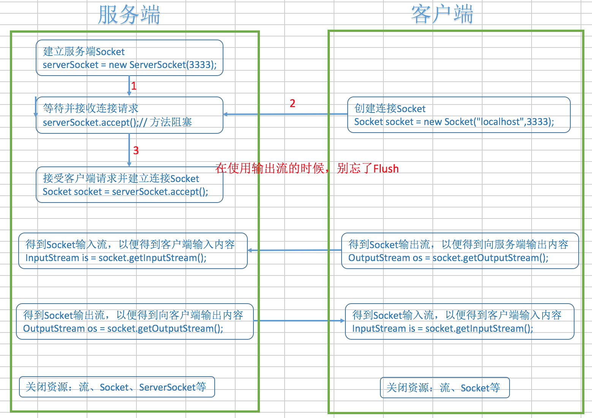
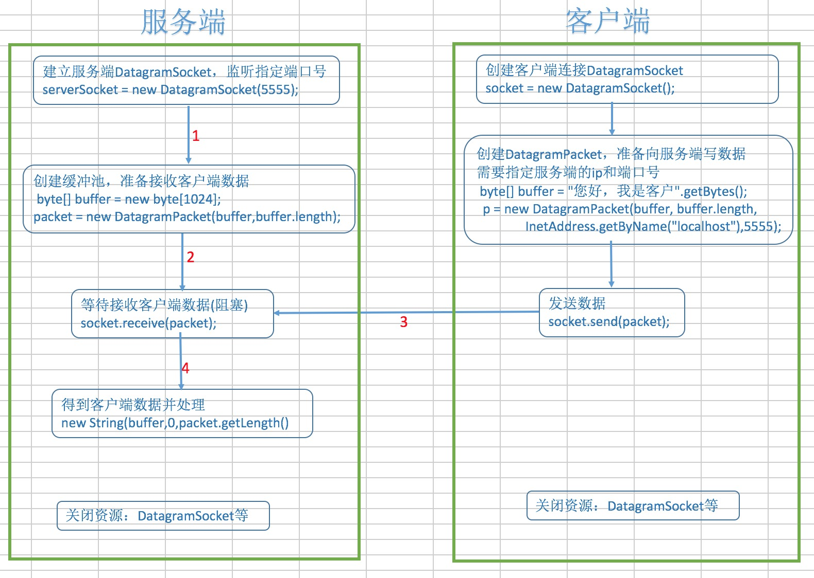

# Socket编程

## 概述

> TCP/IP是目前世界上应用最广泛的协议，是以TCP和IP为基础的不同层次的多个协议的集合，也称为TCP/IP协议族或者协议栈

* TCP: Transmission Control Protocol,传输控制协议
* IP: Internet Protocol,互联网协议
* ip的作用:实现不同的计算机之间的通信，每个机器都有自己的唯一的标识，即ip地址
* 端口号:为了区别不同的应用
* socket：即ip地址加上端口号，socket是网络上运行的程序之间的双向通信的终点，是TCP和UDP的基础
   > IP+端口号可以类比公司的总机+分机号的概念
   
   > Socket是网络通讯的基础
* 端口号的范围是1-65535,其中1-1024为系统保留
   > 常见默认端口号——http:80,ftp:21,telnet:23


*网络分层模型:*



## 一些概念

* InetAddress：用于标识网络上的硬件资源，主要是ip
* URL：统一资源定位符，通过URL可以读写网络上的数据
* Socket:使用TCP协议实现网络通信的Socket相关的类
* Datagram:数据包，使用UDP协议，将数据保存在数据报中，通过网络进行通讯
* TCP：面向对象的，可靠地，有序的，以字节流的方式发送数据

## TCP通信主要流程

1. 创建ServerSocket以及Socket
2. 打开连接到Socket的IO流
3. 按照协议对Socket进行读写操作
4. 关闭IO流，关闭Socket

*示意图:*



*代码*

* 工具类 —— `CloseUtils.java`

```
package com.xinye.net.tcp;

import java.io.Closeable;
import java.io.IOException;

public class CloseUtils {
    
    public static <T extends Closeable> void close(T t){
        if(t != null){
            try {
                t.close();
            } catch(IOException e) {
                e.printStackTrace();
            }
        }
    }
    
}

```

* 服务端 —— `Server.java`

```
package com.xinye.net.tcp;

import java.io.BufferedReader;
import java.io.IOException;
import java.io.InputStream;
import java.io.InputStreamReader;
import java.io.OutputStream;
import java.io.PrintWriter;
import java.net.ServerSocket;
import java.net.Socket;
import java.util.concurrent.ExecutorService;
import java.util.concurrent.Executors;

public class Server {
    
    
    public static void main(String[] args) {
        ExecutorService service = Executors.newCachedThreadPool();
        ServerSocket serverSocket = null;
        try {
            serverSocket = new ServerSocket(3333);
            while(true && !Thread.currentThread().isInterrupted()){
                System.out.println("======服务端就绪，等待新的客户端连接=======");
                Socket socket = serverSocket.accept();
                service.execute(new HandleClient(socket));
            }
        } catch(IOException e) {
            e.printStackTrace();
        }finally {
            CloseUtils.close(serverSocket);
        }
        
    }
    
    private static class HandleClient implements Runnable{
        
        private Socket socket;
        
        public HandleClient(Socket socket){
            this.socket = socket;
        }
        
        @Override
        public void run() {
            InputStream is = null;
            InputStreamReader isr = null;
            BufferedReader br = null;
            
            OutputStream os = null;
            PrintWriter bw = null;
            try {
                is = socket.getInputStream();
                isr = new InputStreamReader(is);
                br = new BufferedReader(isr);
                
                String clientContent = null;
                while((clientContent = br.readLine()) != null){
                    System.out.println("客户端输入内容:" + clientContent);
                }
                
                socket.shutdownInput();
                
                os = socket.getOutputStream();
                bw = new PrintWriter(os);
                
                bw.write("欢迎您，来自:" + socket.getInetAddress().getHostAddress() + ":" + socket.getPort() + "的用户");
                bw.flush();
                
                socket.shutdownOutput();
                
            } catch(IOException e) {
                e.printStackTrace();
            }finally{
                CloseUtils.close(bw);
                CloseUtils.close(os);
                
                CloseUtils.close(br);
                CloseUtils.close(isr);
                CloseUtils.close(is);
                
                CloseUtils.close(socket);
            }
        }
        
    }
    
}

```

* 客户端 —— `Client.java`

```
package com.xinye.net.tcp;

import java.io.BufferedReader;
import java.io.IOException;
import java.io.InputStream;
import java.io.InputStreamReader;
import java.io.OutputStream;
import java.io.PrintWriter;
import java.net.Socket;
import java.util.Random;

public class Client {

    public static void main(String[] args) {
        Socket socket = null;
        
        OutputStream os = null;
        PrintWriter bw = null;
        
        InputStream is = null;
        InputStreamReader isr = null;
        BufferedReader br = null;
        Random random = new Random();
        try {
            socket = new Socket("localhost",3333);
            os = socket.getOutputStream();
            bw = new PrintWriter(os);
            
            bw.write("hello，我是隔壁老王 - " + random.nextGaussian());
            
            bw.flush();
            socket.shutdownOutput();
            
            is = socket.getInputStream();
            isr = new InputStreamReader(is);
            br = new BufferedReader(isr);
            
            String serverContent = null;
            while((serverContent = br.readLine()) != null){
                System.out.println("服务端的输出：：" + serverContent);
            }
            
            socket.shutdownInput();
            
        } catch(IOException e) {
            e.printStackTrace();
        }finally{
            CloseUtils.close(br);
            CloseUtils.close(isr);
            CloseUtils.close(is);
            
            CloseUtils.close(bw);
            CloseUtils.close(os);
            
            CloseUtils.close(socket);
        }
    }

}

```

## UDP通讯主要流程

* UDP:用户数据包协议，无连接，不可靠，无序，速度相对较快
* 进行数据传输时，首先需要将传输的数据定义成Datagram,在数据报中知名数据所要到达的Socket(主机地址和端口号)，然后讲数据发送出去
* DatagramPacket:数据报
* DatagramSocket:进行端到端通讯的类

* Server流程
   > * 创建DatagramSocket，指定端口号
   > * 创建DatagramPacket(一般是两个参数那个)
   > * 接受Client发送的数据信息(receive)
   > * 读取数据
 
* 客户端
   > * 定义发送的数据信息(host,port,content)
   > * 创建DatagramPacket,包含要发送的信息
   > * 创建DatagramSocket(实现发送)
   > * 发送数据(send)
   
*示意图:*



*代码*

* 服务端 —— `DatagramServer.java`

```
package com.xinye.net.udp;

import java.io.IOException;
import java.net.DatagramPacket;
import java.net.DatagramSocket;
import java.net.SocketException;
import java.util.concurrent.ExecutorService;
import java.util.concurrent.Executors;

import com.xinye.net.tcp.CloseUtils;

public class DatagramServer {
    
    public static void main(String[] args) {
        ExecutorService service = Executors.newCachedThreadPool();
        DatagramSocket serverSocket = null;
        try {
            serverSocket = new DatagramSocket(5555);
            while(true && !Thread.currentThread().isInterrupted()){
                System.out.println("==== 服务端正在等待客户端连接 ====");
                service.execute(new ServerRunnable(serverSocket));
            }
            
        } catch(SocketException e) {
            e.printStackTrace();
        } finally{
            CloseUtils.close(serverSocket);
        }
    }
    private static class ServerRunnable implements Runnable{
        private DatagramSocket socket;
        private ServerRunnable(DatagramSocket socket){
            this.socket = socket;
        }
        @Override
        public void run(){
            try{
                byte[] buffer = new byte[1024];
                DatagramPacket packet = new DatagramPacket(buffer,buffer.length);
                socket.receive(packet);
                System.out.println("客户端" + packet.getAddress().getHostAddress() + ":" + packet.getPort() 
                    + "输入的内容:" + new String(buffer,0,packet.getLength()));
                
                byte[] b = "服务端欢迎您!!!".getBytes();
                DatagramPacket p = new DatagramPacket(b, b.length, packet.getAddress(),packet.getPort());
                socket.send(p);
            }catch(IOException e){
                e.printStackTrace();
            }finally{
                socket = null;
            }
        }
    }
}

```

* 客户端 —— `DatagramClient.java`

```
package com.xinye.net.udp;

import java.io.IOException;
import java.net.DatagramPacket;
import java.net.DatagramSocket;
import java.net.InetAddress;
import java.net.SocketException;
import java.net.UnknownHostException;

import com.xinye.net.tcp.CloseUtils;

public class DatagramClient {

    public static void main(String[] args) {
        DatagramSocket socket = null;
        try {
            socket = new DatagramSocket();
            
            byte[] buffer = ("您好，我是客户" + System.currentTimeMillis()).getBytes();
            DatagramPacket packet = new DatagramPacket(buffer, buffer.length, 
                InetAddress.getByName("localhost"),5555);
            socket.send(packet);

            byte[] b = new byte[1024];
            DatagramPacket p = new DatagramPacket(b,b.length);
            socket.receive(p);
            System.out.println(new String(b,0,p.getLength()));
            
        } catch(SocketException e) {
            e.printStackTrace();
        } catch(UnknownHostException e) {
            e.printStackTrace();
        } catch(IOException e) {
            e.printStackTrace();
        }finally{
            CloseUtils.close(socket);
        }
    }
}

```


